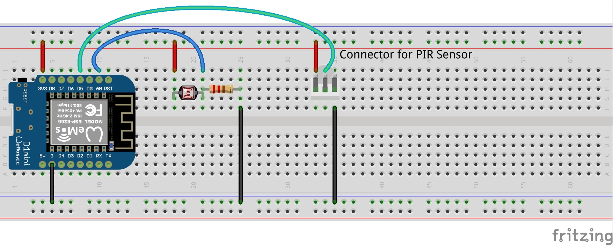

WiFi PIR Sensor/Luxmeter for ESP8266
====================================

This is firmware for simple wireless PIR sensor and luxmeter controlled over MQTT.
It uses the [Homie MQTT convention](https://github.com/marvinroger/homie)
and is based on [Homie implementation for ESP8266](https://github.com/marvinroger/homie-esp8266) by Marvin Roger,
benefiting from all the features this library provides, like:
[captive web portal for initial configuration](https://https://homie-esp8266.readme.io/docs/ui-bundle),
[OTA updates over MQTT](https://homie-esp8266.readme.io/docs/ota-configuration-updates#section-ota-updates),
[WiFi reconfiguration over MQTT ](https://homie-esp8266.readme.io/docs/ota-configuration-updates#section-configuration-updates)
etc.

Parts
-----

- [Wemos D1 Mini](https://www.aliexpress.com/wholesale?catId=0&initiative_id=AS_20170313030458&SearchText=wemos+d1+mini)
- PIR module [HC-SR501](https://www.aliexpress.com/wholesale?catId=0&initiative_id=SB_20170313030335&SearchText=HC-SR501) 
(actually this module triggers randomly when WiFI is on, I'm actually planning to replace it with 
[AM312](https://www.aliexpress.com/item/Mini-IR-Pyroelectric-Infrared-PIR-Motion-Human-Sensor-Automatic-Detector-Module-high-reliability-12mm-x-25mm/32749737125.html?spm=2114.13010608.0.0.SCUcKl) )
- Photocell [GL5528](https://www.aliexpress.com/wholesale?catId=0&initiative_id=SB_20170313030456&SearchText=GL5528)
- 15K Resistor (or whatever other you like)

... or something similar :-)

Wiring
------

- photocell goes to A0
- PIR sensor goes to D5




Setup
-----

Import this code into [platformio](http://platformio.org/), then run build target "PlatformIO: Upload SPIFFS Image".

Adjust the photocell type, and resistor value in the code in [src/main.cpp](src/main.cpp#L5)
to match whatever you have.
(You may need to follow the instructions for the [Arduino Light Dependent Resistor Library](https://github.com/QuentinCG/Arduino-Light-Dependent-Resistor-Library/)
if your photocell is not supported by the library directly)

Then you could compile and upload the sketch to your board as usual.

Once you upload the sketch, you have to configure the node as described in
[Homie Getting Started Tutorial](http://marvinroger.github.io/homie-esp8266/docs/develop/quickstart/getting-started/)
(this is where you device gets device id assigned)

Interface
---------

- The device will report the status from PIR sensor to MQTT topic `homie/<deviceid>/pir/motion`

```bash
$ mosquitto_sub -h 192.168.1.50 -v -t "homie/a020a61590a1/pir/motion"
homie/a020a61590a1/pir/motion NO
homie/a020a61590a1/pir/motion YES
homie/a020a61590a1/pir/motion NO
```

- The device will report light intensity (in [lx](https://en.wikipedia.org/wiki/Lux))
from photocell to MQTT topic `homie/<deviceid>/photocell/lux`

```bash
$ mosquitto_sub -h 192.168.1.50 -v -t "homie/a020a61590a1/photocell/lux"
homie/a020a61590a1/photocell/lux 118.61
```

to adjust the interval how often is the light intensity reported publish
the new value to "homie/<deviceid>/photocell/interval/set" (in seconds)

```bash
$ mosquitto_pub -h 192.168.1.50 -t "homie/a020a61590a1/photocell/interval/set" -m "5"
```

- similarly you could control the built-in LED by publishing to following topics

```
homie/<deviceid>/led/brightness/set <0..1023>
homie/<deviceid>/led/status/set  <ON|OFF>
```
